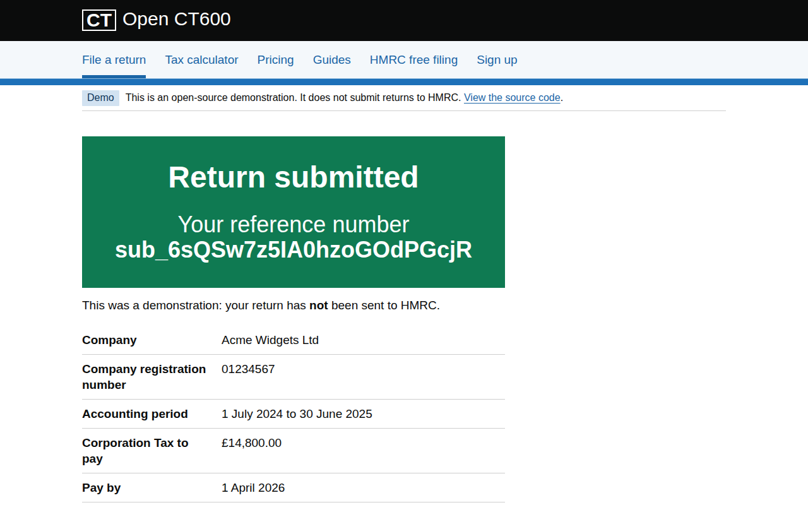

# Open CT600

A free, open-source website for preparing a UK Company Tax Return (CT600). It takes the place of HMRC's
old online filing service for small companies, which closed on 31 March 2026, and replicates
[taxpipe.co.uk](https://taxpipe.co.uk/) as open source.

- **Frontend:** React 19 + TypeScript (Vite), built on the [GOV.UK Design System](https://design-system.service.gov.uk/)
  (`govuk-frontend` 6).
- **Backend:** Python 3.13 + FastAPI. It computes Corporation Tax and the CT600 boxes, and delivers
  sign-ups to a [webhook.site](https://webhook.site/) URL.

> **This is a demonstration.** It does not submit returns to HMRC and is not HMRC-recognised software.
> Use it to prepare and check your figures, then file with
> [HMRC-recognised software](https://www.gov.uk/government/publications/corporation-tax-commercial-software-suppliers/corporation-tax-commercial-software-suppliers)
> or an accountant. It is not tax advice.


## What it does

| Area | What you get |
| --- | --- |
| Filing service (`/file`) | Uses the GOV.UK start page, task list and one-topic-per-page patterns: company details, accounting period, profit and loss account, tax adjustments and micro-entity balance sheet. Check your answers shows every CT600 box, the tax computation and the accounts. After a declaration, it issues a demo receipt with a submission reference and a fingerprint of the return. |
| Tax calculator (`/calculator`) | Corporation Tax for any period from 1 April 2017 to 31 March 2027, with marginal relief, associated companies, short periods and periods that span 1 April. |
| Sign-up (`/sign-up`) | Name, email and company name, validated by the API and posted as JSON to your webhook.site URL. It asks for no password, because anyone who has a webhook.site URL can read what is posted to it. |
| Content | Home, pricing (free), HMRC free-filing closure explainer, guides, help/FAQ, privacy, cookies (none are used), accessibility statement and terms. |

Drafts are kept only in the user's browser (`localStorage`). The API stores nothing.

| Task list | Check your answers | Confirmation |
| --- | --- | --- |
|  |  |  |

### Tax rules implemented

The rules are in `backend/src/open_ct600/tax.py`, following CTA 2010 as amended by Finance Act 2021:

- FY2017 to FY2022: a flat 19%.
- FY2023 onwards:
  - The small profits rate of 19% applies where augmented profits are £50,000 or less.
  - The main rate of 25% applies at £250,000 or more.
  - In between, marginal relief is 3/200 × (U − A) × N/A.
- Limits are divided by the number of associated companies plus one. For periods shorter than 12
  months they are cut in proportion to days / 365. A 12-month period that includes 29 February
  keeps the full limits.
- Periods that span 1 April are split by days, and each slice is taxed at its own year's rates.
- Payment is due 9 months and 1 day after the period ends. The return is due 12 months after.
- The CT600 boxes produced are 145–315 (profits), 326/329 (associated companies and relief
  entitlement), 330–345 and 380–395 (the rows for each financial year), and 430–525 (tax
  payable).

Not implemented: iXBRL accounts and computations, real HMRC submission (Government Gateway /
Transaction Engine), group relief, R&D relief, and the supplementary pages (CT600A onwards).

## Running it

You need Python 3.13 with [uv](https://docs.astral.sh/uv/), Node 22 and pnpm 12.

```sh
cp .env.example backend/.env   # then set SIGNUP_WEBHOOK_URL to your https://webhook.site/<token>

# API on :8000
cd backend && uv sync && uv run uvicorn --factory open_ct600.main:create_app --reload

# Frontend on :5173, which proxies /api to :8000
cd frontend && pnpm install && pnpm dev
```

To get a webhook URL, open https://webhook.site and copy "Your unique URL". Each sign-up then
shows up there as a JSON `POST`:

```json
{"event": "signup", "reference": "sgn_…", "received_at": "…", "full_name": "…", "email": "…", "company_name": "…"}
```

If `SIGNUP_WEBHOOK_URL` is not set, the API refuses to start.

### Docker

One image serves both the API and the built frontend:

```sh
docker build -t open-ct600 .
docker run --rm -p 8000:8000 -e SIGNUP_WEBHOOK_URL=https://webhook.site/<token> open-ct600
```

## API

| Method | Path | Purpose |
| --- | --- | --- |
| `GET` | `/api/health` | Liveness |
| `POST` | `/api/calculator` | Corporation Tax for `period_start`, `period_end`, `taxable_profits`, `associated_companies` |
| `POST` | `/api/returns/compute` | CT600 boxes, tax computation and micro-entity accounts for a full return |
| `POST` | `/api/returns/submit` | Takes a return plus a declaration and issues a demo receipt. Nothing is sent to HMRC. |
| `POST` | `/api/signup` | Validates the registration and forwards it to `SIGNUP_WEBHOOK_URL` |

Interactive docs are at `/docs` while the API is running. Validation errors are FastAPI's standard
`422` responses, with messages written in GOV.UK style.

## Development

```sh
# backend
cd backend && uv run ruff format --check . && uv run ruff check . && uv run ty check && uv run pytest

# frontend
cd frontend && pnpm lint && pnpm format:check && pnpm test && pnpm build
```

The same checks run in CI (`.github/workflows/ci.yml`) and as [prek](https://github.com/j178/prek)
hooks (`prek install`).

### Design system notes

The site uses `govuk-frontend` components and patterns. It is not a GOV.UK service, so it follows the
Design System's rules for services outside GOV.UK:

- It uses the Arial font stack, not GDS Transport.
- It has no crown or crest: the image URL function resolves the crest to `none`.
- It uses the Generic header component rather than the GOV.UK header.

## Licence

[MIT](LICENSE).
