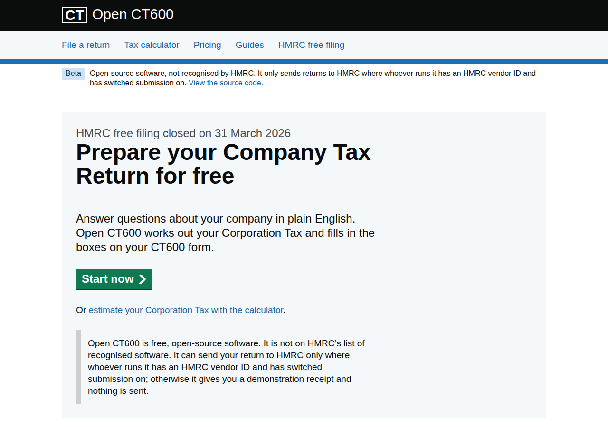
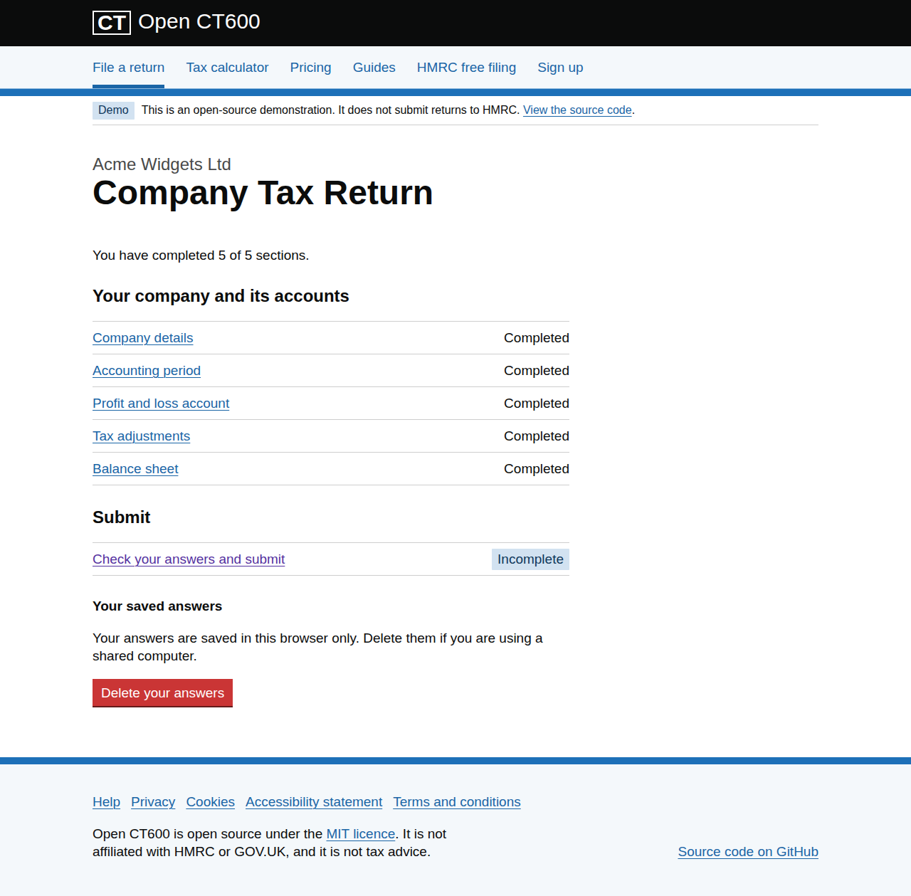
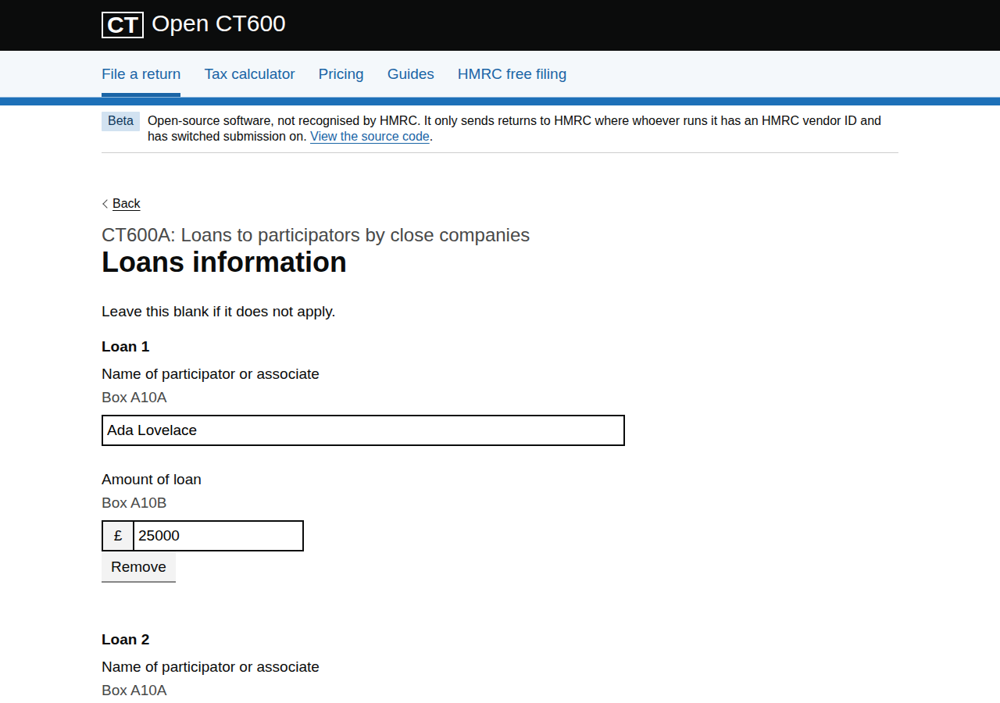

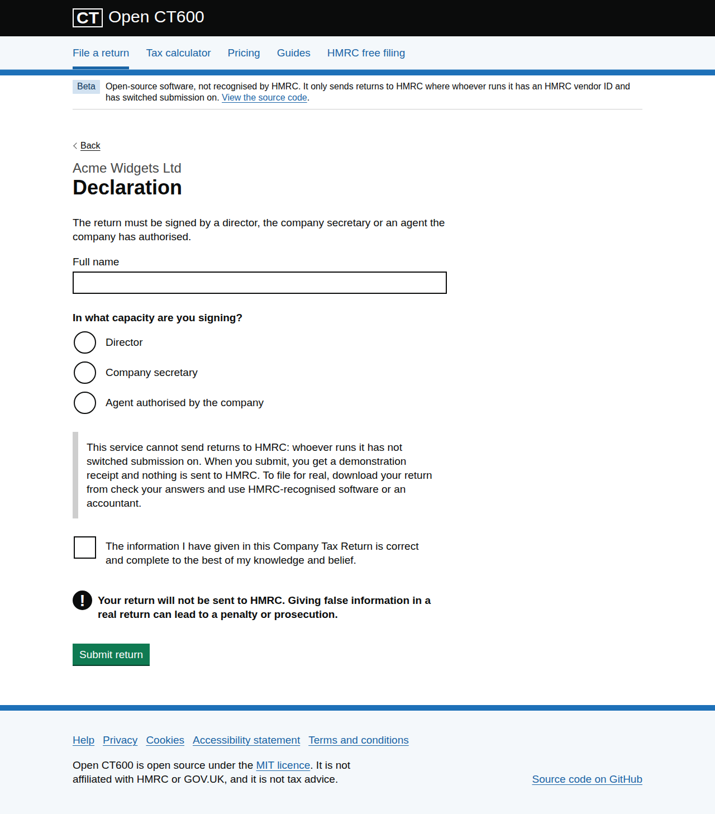

# Open CT600

A free, open-source website for preparing and filing a UK Company Tax Return (CT600). It takes the place
of HMRC's old online filing service for small companies, which closed on 31 March 2026, and replicates
[taxpipe.co.uk](https://taxpipe.co.uk/) as open source.

- **Frontend:** React 19 + TypeScript (Vite), built on the [GOV.UK Design System](https://design-system.service.gov.uk/)
  (`govuk-frontend` 6).
- **Backend:** Python 3.13 + FastAPI. It computes Corporation Tax, reliefs and every CT600 box. It also
  produces the iXBRL accounts and computations and the CT600 XML, validates them against HMRC's own
  rules, and can submit them to HMRC.

> **Open CT600 is not HMRC-recognised software, and it is not tax advice.** A deployment submits
> returns to HMRC only when its operator holds an HMRC vendor ID and switches submission on (see
> [Submitting to HMRC](#submitting-to-hmrc)). Otherwise it prepares and checks your return, gives you
> the files, and issues a demonstration receipt.



## What it does

| Area | What you get |
| --- | --- |
| Filing service (`/file`) | GOV.UK start page, task list and question pages: company details, accounting period, profit and loss, tax adjustments, balance sheet, accounts details (standard, directors, approval, dormancy), reliefs, and supplementary pages. |
| Supplementary pages | CT600A–CT600P (CT600G is dormant). The user picks the pages that apply. Each page is a form generated from HMRC's schema, with box numbers as hints and add-another lists; the service works out the calculated boxes. |
| Reliefs | Group relief (CT600C). R&D: SME and large-company RDEC before 1 April 2024; merged RDEC or ERIS after. Loans to participators (s455, CT600A). The calculations for each page and how they feed the main return. |
| Check your answers | Every CT600 box, the tax computation, the reliefs and the accounts. HMRC's offline validation is shown too: its XSD and all 1,072 business rules, with HMRC's error codes, linked to the question to fix. |
| Files | iXBRL statutory accounts (micro-entity FRS 105 or small FRS 102 1A, FRC 2026 taxonomy); iXBRL Corporation Tax computations (HMRC ct-comp 2024); CT600 XML (schema v1.994) with both attached. |
| Submission | Test in Live or live submission through HMRC's Transaction Engine, using the company's Government Gateway user ID and password. The password is passed straight to HMRC and never stored or logged. The confirmation shows HMRC's receipt: IRmark, correlation ID and accepted time. |
| Tax calculator (`/calculator`) | Corporation Tax for any period from 1 April 2017 to 31 March 2027, with marginal relief, associated companies, short periods and periods that span 1 April. |
| Content | Home, pricing (free), HMRC free-filing closure explainer, guides, help/FAQ, privacy, cookies (none are used), accessibility statement and terms. |

Drafts are kept only in the user's browser (`localStorage`). The API stores nothing.

| Task list | Supplementary page (CT600A) | Check your answers | Declaration |
| --- | --- | --- | --- |
|  |  |  |  |

## How it is verified

| What | How |
| --- | --- |
| Tax, reliefs and pages | Unit tests using worked examples from HMRC guidance and manuals for each relief and page, checked by hand. Mutation checks on the core formulas. |
| CT600 XML | Every return shape in the tests passes HMRC's v1.994 XSD and HMRC's schematron offline with zero problems. |
| IRmark | Reproduces HMRC's published worked example byte for byte. |
| iXBRL | Every generated document passes [Arelle](https://arelle.org/) offline, with the UK plugin and the HMRC disclosure system, against the FRC and HMRC taxonomy packages pinned by SHA-256 in `specs/ixbrl/taxonomies.tsv`. Any warning fails the test. |
| End to end with HMRC | `pytest -m hmrc_tpvs` sends synthetic returns with real iXBRL to HMRC's third-party validation service (TPVS) and expects a signed receipt whose digest equals our IRmark. The returns are micro-entity, small company, net liabilities, group relief, s455 loans, SME R&D, merged RDEC, ERIS and a tax avoidance scheme disclosure. All pass. |
| Transaction Engine | Submit → poll → delete and every HMRC error class are tested against a stub Transaction Engine that replays HMRC's messages. |

## Submitting to HMRC

HMRC accepts CT600 returns only from software that sends its vendor ID. HMRC's Software Developers
Support Team (SDSTeam@hmrc.gov.uk) issues the ID and runs the recognition process. To enable
submission on your deployment:

```sh
HMRC_VENDOR_ID=1234            # your 4-digit HMRC vendor ID
HMRC_SUBMISSION_ENABLED=true   # off by default, so a public demo never handles Gateway passwords
```

- **Test in Live** (class `HMRC-CT-CT600-TIL`) has HMRC check the whole return with real credentials,
  without filing it.
- **Protect a submitting deployment.** With submission on, the service passes whatever Government
  Gateway credentials it receives to HMRC under your vendor ID. Put it behind your own authentication
  and rate limiting, so it can't be used to test credentials against HMRC. With submission off, the
  page never asks for credentials.
- **Not yet exercised against HMRC:** live and Test in Live submission need a vendor ID and real
  credentials, so the submit → poll → delete flow is tested only against the stub Transaction Engine.
  The message itself (schema, business rules, IRmark and iXBRL) is proven on TPVS.

## Known limitations

- **Computations for periods ending after 31 March 2026.** HMRC accepts its 2024 computations
  taxonomy only for these earlier periods, and has not yet published the 2025 one. For later periods the
  service explains this and does not submit; the accounts and CT600 XML are still produced.
- **s455 at 35.75%.** Loans made from 6 April 2026 are filed at 33.75%, because HMRC's online service
  accepts the new rate only from April 2027. The difference is shown as tax due on amendment.
- **Not calculated:**
  - The restriction on using carried-forward losses above the £5 million deductions allowance.
  - Income tax deducted from income (box 515).
- **Refused, with a clear message rather than a wrong return:**
  - Insurance companies (company type 5) and REIT tax-exempt businesses (type 10).
  - Periods of account longer than 12 months.
  - Ring fence trades in periods starting before 1 April 2023, because the older ring fence limits aren't modelled.
- **CT600A later-repayment relief** assumes the company's later accounting periods are 12 months long,
  because the page has no field for them.
- **No PDF attachments.** Answers that HMRC requires a PDF for are rejected, for example CT600C
  "notices of consent attached" (HMRC rule 9552). Use the simplified arrangements authorisation
  instead.
- **Accounts are single-period.** There are no prior-year comparatives, and the legal form is always
  private limited company. HMRC's ct-comp 2024 taxonomy has no elements for marginal relief or the
  merged RDEC and ERIS steps, so those appear in the computation text untagged.

## Running it

You need Python 3.13 with [uv](https://docs.astral.sh/uv/), Node 22 and pnpm 12.

```sh
# API on :8000
cd backend && uv sync && uv run uvicorn --factory open_ct600.main:create_app --reload

# Frontend on :5173, which proxies /api to :8000
cd frontend && pnpm install && pnpm dev
```

### Docker

One image serves both the API and the built frontend:

```sh
docker build -t open-ct600 .
docker run --rm -p 8000:8000 open-ct600
```

## API

| Method | Path | Purpose |
| --- | --- | --- |
| `GET` | `/api/health` | Liveness |
| `GET` | `/api/schema/pages` | Supplementary pages A–P: their schema trees and the boxes the service calculates |
| `POST` | `/api/calculator` | Corporation Tax for a period and taxable profits |
| `POST` | `/api/returns/compute` | CT600 boxes, tax computation, reliefs, completed pages and accounts |
| `POST` | `/api/returns/validate` | HMRC's XSD and business rules run offline, with problems mapped to boxes and questions |
| `POST` | `/api/returns/accounts.xhtml` | iXBRL statutory accounts |
| `POST` | `/api/returns/computations.xhtml` | iXBRL Corporation Tax computations |
| `POST` | `/api/returns/ct600.xml` | CT600 XML with the iXBRL attached |
| `POST` | `/api/returns/submit-to-hmrc` | Test in Live or live submission; needs `HMRC_SUBMISSION_ENABLED` and `HMRC_VENDOR_ID` |
| `POST` | `/api/returns/submit` | Demonstration receipt. Nothing is sent to HMRC. |

The return endpoints take `{"ct600": …, "declaration": …}`. Interactive docs are at `/docs`.

## Development

```sh
# backend (add -m hmrc_tpvs to run the opt-in TPVS tests; synthetic data only)
cd backend && uv run ruff format --check . && uv run ruff check . && uv run ty check && uv run pytest

# frontend
cd frontend && pnpm lint && pnpm format:check && pnpm test && pnpm build
```

The same checks run in CI (`.github/workflows/ci.yml`) and as [prek](https://github.com/j178/prek)
hooks (`prek install`). The design is in [`docs/design/filing-with-hmrc.md`](docs/design/filing-with-hmrc.md).
The official material it is built against is in [`specs/`](specs/README.md): HMRC schemas and
business rules, the box map, samples, taxonomy pins and research notes.

### Design system notes

The site uses `govuk-frontend` components and patterns. It is not a GOV.UK service, so it follows the
Design System's rules for services outside GOV.UK:

- It uses the Arial font stack, not GDS Transport.
- It has no crown or crest: the image URL function resolves the crest to `none`.
- It uses the Generic header component rather than the GOV.UK header.

## Licence

[MIT](LICENSE). HMRC schemas and documents in `specs/` are Crown copyright under the Open Government
Licence v3.0.
